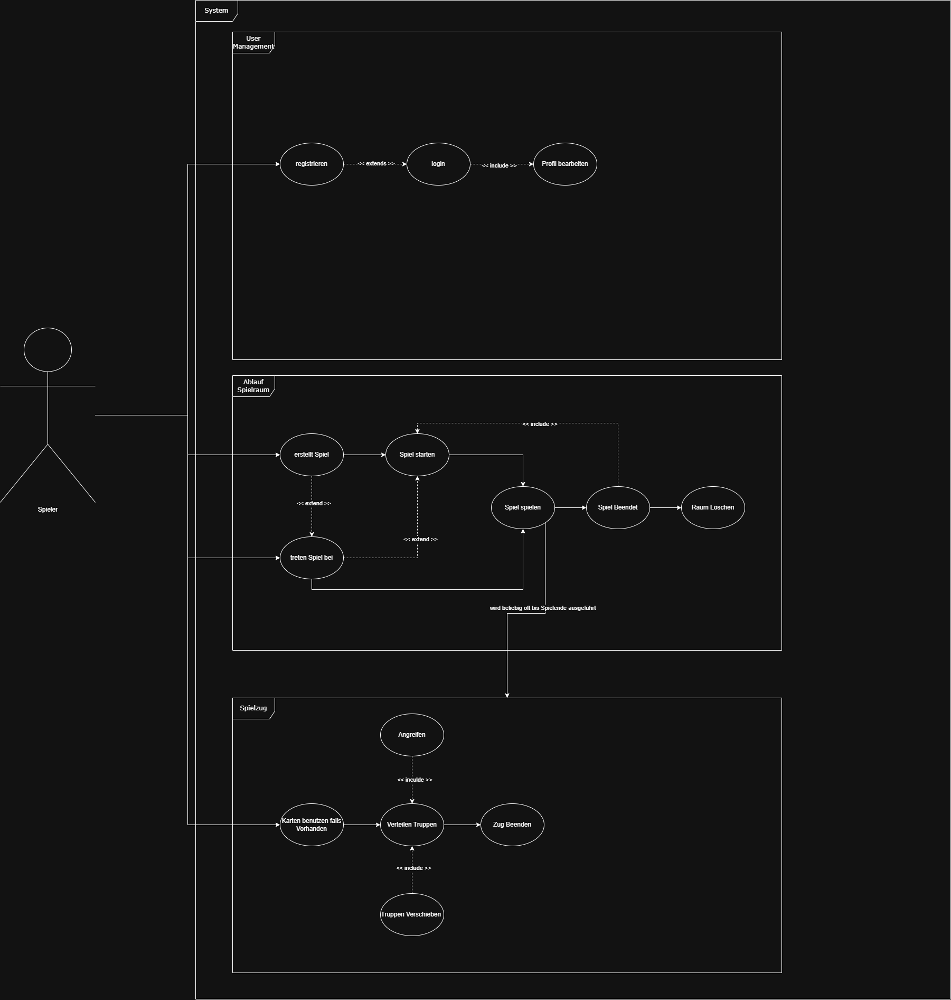

# Caesar's Gambit

## Statistik Aufwändungen 

| Hauptbeitrag              | Stunden    | Person   |
|---------------------------|------------|----------|
| SVG-Map                   | 10 h       | Svenja   |
| Startseite                |  9 h       | David    |
| Lobbypage                 | 10 h       | Justin   |
| Raum-/ Spiellogik Backend | 11 h       | Matthias |
| Deployment                |  9 h       | Simon    |

| Workflow                     | Stunden Pro Workflow
|------------------------------|---------------------|
| Requirements                 | 20 h                | 
| Analysis & Design            | 40 h                | 
| Implementations              | 75 h                | 
| Test                         |  0 h                |
| Deployment                   |  5 h                | 
| Configuration & Change Mgmt  |  5 h                | 
| Project Management           | 10 h                | 
| Environment                  | 10 h                | 

| Phase         | Stunden Pro Phase 
|---------------|-------------------|
| Inception     | 10 h              | 
| Elaboration   | 40 h              | 
| Construction  | 75 h              | 
| Transition    | 10 h              |  

## Overall UseCase Diagram
schwerpunkte unserer Entwicklung (DEMO)

Der Schwerpunkt der Entwicklung liegt bei dem Use Case Ablauf Spielraum.

Nachdem ein Spieler einen Raum erstellt hat ist es anderen Spielern möglich diesem Raum beizutreten. Dabei ist es Wichtig das durch die SSE jeder 
der Mitglieder im Raum, sowie der Spieler der Beigetreten ist direkt die Spielerliste (Spieler im Raum) korrekt angezeigt bekommt.

Für den Chat ist es wichtig, das die Nachrichten mit dem Absender weitergegeben werden. Auf diese Weise kann bei jedem Spieler die selbst geschreibenen Nachrichten Rechts und die von anderen Raummitglieder links 
inklusive Namen und Logo angezeigt. 

Wird das Spiel gestartet beginnt die Iniziierung des Spiels. Hierbei werden jdem Spieler zufällige Gebiete der Karte zugeweisen. Daraufhin bekommt jeder Spieler die Möglichkeit seine initialen Truppen auf die eigenen Gebiete aufzuteilen. Hierfür gibt es für SSE verschiedene Events wie Gamestart,ask DistTroops wie viele Truppen der Spieler noch zu verteilen hat. Sobalt jdeder die Initialen Truppen verteilt ist das Initialisieren beendet und im Folgenden würde die erste Runde Beginnen. 
 

## Architekturstiele/-entscheidungen
Unsere Architektur kombiniert ein Next.js/React-Frontend mit einem Spring-Boot-Backend, einer klaren Schichtenstruktur und einer PostgreSQL-Datenbank, um eine performante und gut wartbare Spielplattform bereitzustellen. Das Frontend übernimmt UI und Spiellogik in klaren Komponenten und nutzt TypeScript, um Fehler frühzeitig durch statische Typprüfung zu erkennen. Im Backend validiert Spring Boot alle Spielzüge in einer Controller‑Service‑Repository‑Schichtenarchitektur, sodass Regeln zentral durchgesetzt werden und Manipulationen auf Client-Seite verhindert werden. Über Server-Sent Events werden Zustandsänderungen effizient vom Server an alle Clients gepusht, wodurch alle Spieler synchron bleiben, ohne dass die Clients ständig pollen müssen. Persistente Userdaten werden in PostgreSQL verwaltet, während ein SVG-Overlay im Frontend präzise klickbare Regionen ermöglicht, was die UI flexibel erweiterbar macht und die Einführung neuer Einheiten oder Regeln deutlich vereinfacht.

## Softrware Tools/Plattforms

- VS code 
- Docker
- Portainer
- DockerHub
- GitHub 
- Fork